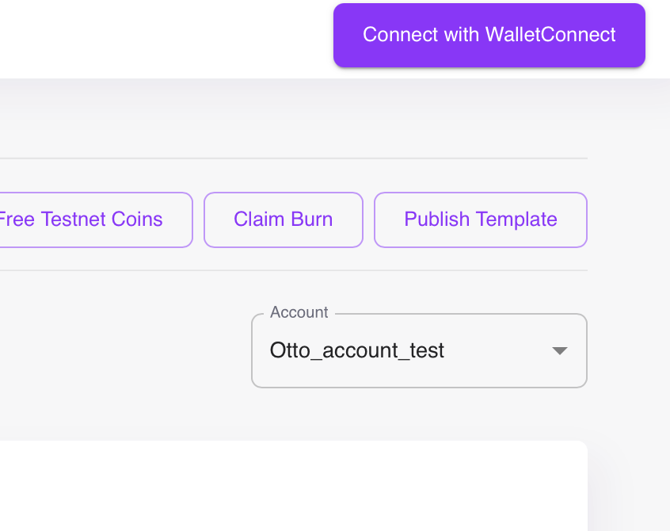

# Hackathon Introduction & Instructions (WIP)

Welcome to this internal Tari Hackathon! The purpose of today's session is to allow you to start interacting with the Ootle, developing contracts and apps and generally running the Ootle through it's paces.

The objective of the Hackathon is simple - develop an app that utilises the Ootle. Whether a game, some unique idea or a more "traditional" blockchain service, we hope you'll experiment and see what works (and what doesn't).

The documents are divided into the following sections:

- Hackthon Intro & Setup - the page you're reading right now. An explanation of what a Tari App consists of, and instructions for setting up all the necessary tools for working with the Ootle.
- Hackathon Sample Projects - Covering a simply counter app and a more robust DEX-related app, Tariswap.
- [Tari.JS Library](tarijs_library_intro.md) - An explanation of the Tari.js library for use in TypeScript projects. For our examples, we'll be using React and Vite.
- [Tari Templates](hackathon_templates.md) - an explanation of Tari templates - what they are, how they work and some basic examples, with a link to more detailed documentation for the `tari_template_lib`

## What is the Ootle?
If you're unfamiliar with the Ootle, we'd like to encourage you to read the [Tari Introduction](tari-introduction.md), which gives a quick, high-level overview of Tari, the Ootle and its various components. While not necessary, it will help provide further context.

## What is a Tari App?
Much focus has been placed on Ootle apps within Universe, a easy to set up, one-click miner for Minotari. The current implementation will serve web apps via the Universe interface in iFrames.

Core to the apps are templates - reusable functionality coded in Rust using the Ootle's `template library, (tari_template_lib)` - which are then compiled as WASM files and commited to the Ootle network. These can then be called to create `components` on the Ootle that can be leveraged by your app.

The templates and created components will serve as the heart of your app's functionality - but that doesn't necessarily mean you need to create them. The Ootle has some pre-existing templates that are already deployed and standard to the experience, such as  `Account` template, and you'll be able to leverage templates uploaded by other developers.

Regardless of whether your leaning on existing templates or creating your own, your web app will need to be able to interact with the Ootle. You can do this easily within your app by using the tari.js library.

So ultimately, your app will consist of:

- Templates that define methods you can call upon to interact with the Ootle through their generated components.
- The `tari.js` TypeScript library to easily interact with the Ootle and deployed templates in your web app via a wallet.
- The actual web app itself, accessible directly through the browser or Universe via iFrame once the URL has been listed. The easist to get started is a React app.
- A wallet that can interact with the Ootle.

## Getting prepped
We've focused on making sure that it's easy to get set up and started, so we've done some pre-setup on our side. However, you're still going to need to configure a couple of items before you can get going.

You'll be using ContractNet, a test network for the Ootle. We've deployed ContractNet so participants can leverage off a common set of already deployed templates as well as potentially interact with other participants (network games, for example)

The following URLs are important to note:

- The [Indexer Node: http://18.217.22.26:12006/json_rpc](http://18.217.22.26:12006/json_rpc): The jRPC address for the indexer node. You'll need to ensure your wallet is connecting to this for your transactions.
- The [Validator Node: http://18.217.22.26:12005](http://18.217.22.26:12005): The Validator Node for ContractNet. We've only deployed a single node at this point, but if you want to review blocks, deployed templates, etc, this is the place to do it.

A list of available templates can be found in the [Tari Templates](hackathon_templates.md)

### Create a React project with the necessary dependencies
The quickest way to set up a new React project is to leverage `vite` to do so. Run the following command below, and select `Y` to continue

```bash
npm create vite@latest
```

Enter a project name, then select `React` from the list of options, and then `Typescript`

```bash
> npx
> create-vite

✔ Project name: … hackathon-app
? Select a framework: › - Use arrow-keys. Return to submit.
    Vanilla
    Vue
❯   React
    Preact
    Lit
    Svelte
    Solid
    Qwik
    Angular
    Others
```

Lastly, choose the `Typescript` variant:

```bash
? Select a variant: › - Use arrow-keys. Return to submit.
❯   TypeScript
    TypeScript + SWC
    JavaScript
    JavaScript + SWC
    React Router v7 ↗
```

Next, you're going to want to update your `package.json` file in the project to include the following items under the `dependencies` section.

Run the following command to do so:

```bash
npm install @tari-project/tari-permissions @tari-project/tarijs @tari-project/typescript-bindings @tari-project/wallet_jrpc_client @tari-project/wallet-daemon-provider
```

Below is what you should be seeing in the package.json file following the above:

```json
    "@tari-project/tari-permissions": "^0.4.0",
    "@tari-project/tarijs": "^0.4.0",
    "@tari-project/typescript-bindings": "^1.4.0",
    "@tari-project/wallet_jrpc_client": "^1.4.0",
    "@tari-project/wallet-daemon-provider": "^0.4.0"
```

### Set up the Ootle Wallet Daemon
You'll need the `tari_dan_wallet_daemon` to proceed. You'll be able to find the latest binaries [here](https://github.com/tari-project/tari-dan/releases). If you don't, look to the end of this section for an alternative means of running the `tari_dan_wallet_daemon`

!!! warning "Release binaries not available"
    Unfortunately, there are no release binaries currently available. It is recommended that you use the Alternative Method mentioned above. Once launched, however, instructions for creating the accounts and claiming fees are the same. 

Once you have it, open your terminal and run the following command:

```bash
./tari_dan_wallet_daemon --help
```

This will provide useful information in addition to command instructions - specifically, the default base directory and the location of the config file.

To start the wallet, run:

```bash
tari_dan_wallet_daemon --network igor
```

If no data exists, it will create a config file and associated data folder using the defaults mentioned in the help section.

!!! tip "Tip"
    You can pass the `-b` command and specify a directory to create a new wallet database and configuration file within your desired location. This can be useful if you are having issues or want to have multiple wallets available. If you are experiencing issues connecting to ContractNet with your wallet, you can use this full command to point directly to the Indexer node on ContractNet: `tari_dan_wallet_daemon -b [yourfolderforstoringdata] --network igor --indexer-url=http://18.217.22.26:12006/json_rpc`

This will start the wallet, and you should see the following below:

```bash
15:18 INFO  🌐 JSON-RPC listening on 127.0.0.1:9000
15:18 INFO  💤 Stopping JSON-RPC
15:18 INFO  🕸️ HTTP UI started at 127.0.0.1:5100
15:18 INFO  🕸️ HTTP UI listening on 127.0.0.1:5100
```
Navigating to the HTTP URL shown will allow you to access the Ootle wallet's web interface. At this point, you will not have an account (if you're wondering, but wait, what's an account - we'll be explaining some of these items in the following sections.), so you will need to create one. Enter the Account Name and select **"Create Account"** to create the associated account and proceed to the main wallet interface.


This will be your primary wallet to use with either your unique app or the sample app provided. Once created, you'll see the following:


The important actions here are:
- `Claim Free Tokens`, which will give you the necessary tokens required to perform transactions, submit contracts and perform other activities on the Ootle.
- `Connect with WalletConnect`, which will allow you to connect your wallet with your app for testing purposes (more in a bit).
- `Publish template`, which allows you to select a compiled WASM template for upload, estimate the fees required to submit and prevent you from uploading too large a template.

If you have created an account for the first time, you will have likely have received free tokens already. If not, or you are creating multiple accounts, just use the `Claim Free Tokens` to get the necessary tokens for testing.

#### Alternative Wallet Daemon Setup method

If you have issues with the main method, you can also run the wallet directly from the Ootle repo. In which case, clone the repo: 

```
git clone https://github.com/tari-project/tari-dan.git
```

And run the wallet via `cargo run --bin tari_dan_wallet_daemon --release -- -b data/w3 --network igor --indexer-url=http://18.217.22.26:12006/json_rpc` directly from the Ootle project.

### Setting up and using the Tari CLI
The `tari cli` tool, located [here](https://github.com/tari-project/tari-cli/), is used to generate template projects and create a couple of pre-existing templates for review. Instructions can be found on the main page of repo, but in short:

```bash
./tari create project_name
```

The above command will create a new skeleton project for template creation. Templates are then placed in the `templates` folder. To create a new template, 

```bash
../tari new [...yourtemplatename...]
✅ Init configuration and directories
✅ Refresh project templates repository
✅ Refresh wasm templates repository
✅ Collecting available WASM templates
🔎 Select WASM template |
  Fungible Tokens - A Fungible Token template to create your own fungible token.
  NFT - A simple NFT template to create your own.
  Tari Swap - Token swapping template
  Counter - A basic counter example template that can be incremented.
```

You will have an option to select from the available templates to create a template. Note that you will be able to replace this template with your own.

The `README.md` on the project's main page provides all the instructions. The main difference here is that you will **NOT** need to use the `tari-cli` to deploy the template, as publishing the template can be done via the Ootle Wallet's web interface.

To generate the WASM file from the project, you can run the following command:

```bash
cargo build --target wasm32-unknown-unknown --release
```

This will generate a .wasm file in the `target/wasm32-unknown-unknown/release` directory.

You can upload this file via the `Publish Template` button in your Wallet UI:

