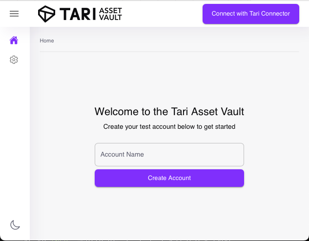
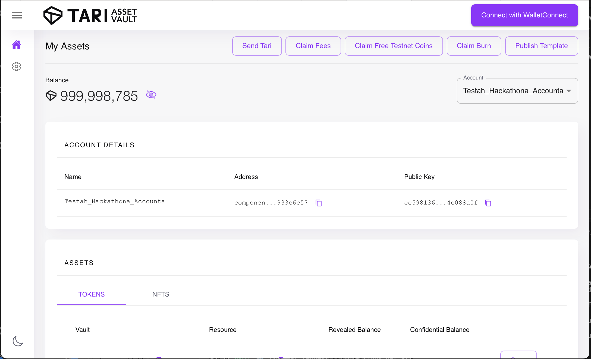

# Ootle Wallet Setup
In order to interact with the Ootle, you will need an Ootle Wallet. The Ootle Wallet not only holds your funds and other assets on the Ootle Network, but is also the tool which we use to interact with the Ootle.

While you are not limited to specifically using the Ootle Wallet, for our example we would like to recommend doing so.

You can download the Ootle Wallet here for your operating system of choice:

- [Ootle Wallet Releases](https://github.com/tari-project/tari-dan/releases)

## Running the Wallet
When you have downloaded the wallet, you'll need to run it from the terminal. Let's open the folder in terminal: 

- On Mac, right-click on the folder in which the Ootle Wallet is located in Finder and select “New Terminal at Folder”
- On Windows, in the folder containing the Ootle wallet, enter “CMD” into the address bar

Once done, run the following command:
   
```bash
./tari_dan_wallet_daemon --help
```

This will provide useful information in addition to command instructions - specifically, the default base directory and the location of the config file.

Fortunately, you don't have to edit anything at this stage - we just need to run the wallet. To start the wallet, run:

```bash
./tari_dan_wallet_daemon --network igor
```

The `--network igor` command ensures you are connecting to the Tari Ootle ContractNet, which is a test network Tari has created for the Ootle.

If no data exists, it will create a config file and associated data folder using the defaults mentioned in the help section.

!!! tip "Tip"
    You can pass the `-b` command and specify a directory to create a new wallet database and configuration file within your desired location. This can be useful if you are having issues or want to have multiple wallets available. If you are experiencing issues connecting to ContractNet with your wallet, you can use this full command to point directly to the Indexer node on ContractNet: `tari_dan_wallet_daemon -b {yourfolderforstoringdata} --network igor --indexer-url=http://18.217.22.26:12006/json_rpc`

This will start the wallet, and you should see the following below:

```bash
15:18 INFO  🌐 JSON-RPC listening on 127.0.0.1:9000
15:18 INFO  💤 Stopping JSON-RPC
15:18 INFO  🕸️ HTTP UI started at 127.0.0.1:5100
15:18 INFO  🕸️ HTTP UI listening on 127.0.0.1:5100
```

Make a note of the address in the line `HTTP UI Started At` - in our example above (and by default for most users), it'll be 127.0.0.1:5100

## Open the wallet in your browser and create an account.

Next, you're going to want to access the wallet. Use your browser and open the link displayed by the wallet above, and create a new account.

Enter the Account Name and select **"Create Account"** to create the associated account and proceed to the main wallet interface.



This will be your primary wallet to use with either your unique app or the sample app provided. Once created, you'll see the following:



The important actions here for now are:

- **`Claim Free Tokens`**, which will give you the necessary tokens required to perform transactions, submit contracts and perform other activities on the Ootle. By default, you should receive enough test tokens to mess around - if not, you can press this button.
- **`Connect with WalletConnect`**, which will allow you to connect your wallet with your app for testing purposes (more in a bit).

**`Publish template`**, which allows you to select a compiled WASM template for upload, estimate the fees required to submit and prevent you from uploading too large a template, will be discussed in our template guide.