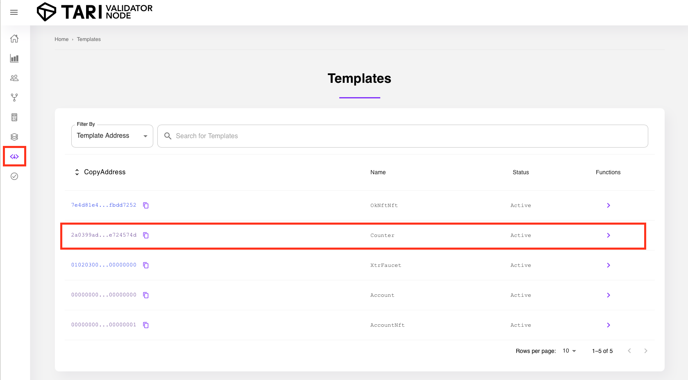

# Introduction

The next step is to add the counter functionality to our app. To do this, our app needs to be able to:

- Create a counter on the Ootle that can be interacted with by our app
- View any counters we've created at this point and check their value

Normally, we'd code a Counter template to do this, but to save time we are going to use an existing template and call it directly. If you'd like to learn more about templates, you can read the [Template introduction here](../tari-templates.md)

!!! tip "What is a Template?"
    Templates are parameterised smart contracts. Templates are intended to be well-tested, secure, reusable components for building and running smart contracts on the DAN. It is the result of a compiled WASM file submitted to the Ootle. An example would be the built-in Non-fungible token (NFT) template, which can be used to create an NFT series.

## Viewing the available counter functions.

As we have already uploaded the template, let's go ahead and review what the template does and what functions we have available.

Users can browse all available templates by browsing to ContractNet's [public validator node here](http://18.217.22.26:12005/templates). You should see a list of templates available, with a `Counter` template. If you do not see the `Counter` template, use the search function and the following address: `2a0399ad3d53490d4fd4984e89d0d6fcad392c4da795117e1a2c01ffe724574d`.

There are several functions available:

- **New**: creates a new component - a counter - that we'll then be able to interact with.
- **Value**: returns the current counter value.
- **Increase**: increase the value of the counter by 1
- **Increase by**: will increase the value of the counter by an amount specified.

So we'll need to start of by calling the `new` function and creating a new component.

!!! tip "What is a Component?"
    An initialisation of a template. In essence, it is also a smart contract, but one that has been created as a result of calling the template. Continuing the example, a user would call the NFT template, creating a new NFT series. The rules and functions available to this NFT series would be then form the component. 

### Creating a New Counter Component

In order to access the `new` function, we will need to submit a transaction on the Ootle that calls the function and creates the component. While many functions are available to call free via the validator node, most app functions will require you to submit a transaction.

Transactions requires several pieces of information to work: which wallet we're using to perform the transaction, which network we're submitting the transaction to, what the amount of fees we're paying the Ootle to process the transaction, and so on.

In our app, we'll need to provide a way to perform the following actions:

- Call on a way to build transactions.
- Be able to initiate a transaction for the purposes of calling the template and creating a new component
- Get the transaction results so we know the transaction succeeded
- Present the new counter component address

We'll be modifying our previous project to perform these functions.

