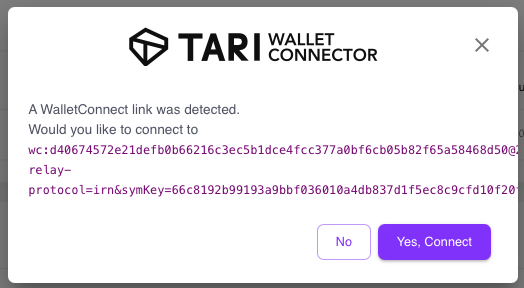

# Connect Your Wallet

This section details using the Wallet Connect button you added earlier to connect your Ootle Wallet to your app via the Connect button in your app. It does this by using a special link generated by your app which your wallet connect detect and use to communicate with your app.

Users can click on the button to bring up the WalletConnect dialog box. The app generates a WalletConnect URI or QR code. Here, click on the button in the top-right corner of the screen. 


Go back to your wallet, press the "Connect with Wallet Connect" button and select the small "Paste" option. When you do so, you'll get something along these lines:



Click, "Yes, Connect" and then Authorize it so it can connect. In this particular case, we are giving full permissions to the app, so it will have total access. There is a way to define the permissions of what the app can do with the wallet, as well as components on the Ootle, which we discuss here.

The user needs to approve the connection. Once done, a secure WebSocket or HTTP connection is established between the wallet and the App. In our case, once the wallet is connect, the app is able to fetch the account details and display our Account address.

## Where does it get this information from?

The Developer Console is where you can access information regarding the data returned by the application. Each browser will have it's own version of the developer console.

When we connect to the wallet, we also request the account details. This is what allows us to display the wallet address. Refresh your app and open up the developer console, then proceed to connect to your wallet. Take note of the messages in the console.

When you've successfully connected, you'll likely see two JSON objects. See an example below:


The first JSON object is the details of the wallet, including the `address` and `public key`

```json
{
  "requestResult": {
    "account": {
      "address": "component_9ba4c157af284840a393783aee01f0c637b5337753f4b2138e0ad1f7ac7de4ab",
      "is_default": true,
      "key_index": 1,
      "name": "hello_ootle_01"
    },
    "public_key": "1063ead5df449e11f34027ccf69bd9a3aa69494f7538c33706ce5e6ad181b738"
  }
}
```

The second returns the balances of the wallet across its different components. For example, your wallet only holds some test Tari at the moment, but it could hold multiple different crytocurrencies and NFTs. This JSON object would return all of those:

```json
{
  "address": "component_9ba4c157af284840a393783aee01f0c637b5337753f4b2138e0ad1f7ac7de4ab",
  "balances": [
    {
      "balance": 999999632,
      "confidential_balance": 0,
      "resource_address": "resource_0101010101010101010101010101010101010101010101010101010101010101",
      "resource_type": "Confidential",
      "token_symbol": "XTR",
      "vault_address": "vault_9ba4c157af284840a393783aee01f0c637b533777994355384a14bcfcaaa5309"
    }
  ]
}
```