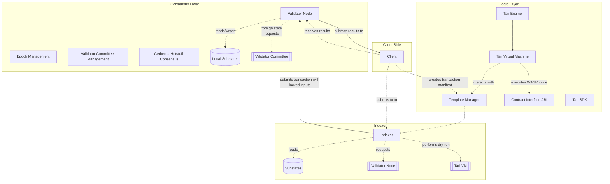

# What is Tari?
* Tari is an open-source protocol for the generation and management of digital assets. Very simply, the protocol defines how new digital assets, such as tokens, NFTs or other digital items can be generated, as well as the rules, mechanisms and penalties for transacting, validating and verifying these assets. Tari works on two levels: the Minotari blockchain and the Tari network (The Ootle).
* Tari is a network of independent people running Tari on their machines in various capacities to process, secure and validate the creation and transaction of digital assets, and commit these transactions to the Minotari blockchain.
* Tari uses the Minotari blockchain to record and validate transactions in an immutable way, so that anyone running or using Tari can check the state of Tari as a whole (How much of it is there? What is it? Who owns it). Think of this as a database that everyone runs their own copy of and agrees reflects the current state of all digital assets on the network.
* Tari is also a cryptocurrency. Specifically, it's two. Minotari (XTM) is rewarded to users that are monitoring transactions, validating that those transactions are legitimate through proof of work (we'll discuss this in more detail at a later stage) and committing transactions to the Minotari blockchain. Minotari can then be "burned" to create Tari (TXM), which is the crytocurrency used on the Ootle to create, transfer and validate digital assets.

All of this is aimed at creating a robust, secure platform through which creators, app developers and users can engage with unique digital assets that they know exist no where else. Whether you're selling tickets to a concert or participating in a video game with unique, one-of-a-kind collectables, Tari is capable of handling it.

## The unique characteristics of Tari
Tari has some unique properties that distinguish it from other protocols like it:

* **Configurable privacy**: By default, transactions on the Minotari blockchain are private through the use of MimbleWimble. On the Ootle, we've designed the protocol to be used in a variety of scenarios, so that those the require transparency (for practical or legal reasons) can provide it.
* **Scripting**: Tari implements a custom scripting language called TariScript, which brings Bitcoin-like scripting functionality to Mimblewimble. This enables features like one-sided payments, atomic swaps, and multi-sig capabilities while maintaining the privacy and scalability benefits of Mimblewimble.
* **Smart contracts and templates**: Users are able to define contracts that will perform certain transactions only once specific programmable criteria are met. This allows users and developers use cases in both simple and complex environments, from ensuring trades to running decentralised autonomous organizations like [stokvels](https://en.wikipedia.org/wiki/Stokvel).
* **Linear scalability**: Scalability - the ability of the of protocol to provide prompt, timely transactions as the network grows - is a core concern of any blockchain protocol. The Tari Network utilises an implementation of Cerebus to provide linear scalability in the Tari layer. As more devices, users and nodes are added to the network the throughput increases.
* **A focus on ease of use**: Tari wants to provide not only the blockchain, but a platform on which users, developers and creators can easily interact. Many of Tari's projects - such as Tari Universe - aim to simplify and remove the complexity that has grown around blockchain technology. No one needs to know the technical intricacies of web technologies to benefit from the Internet. But currently, blockchains and cryptocurrencies require siginificant technical knowledge to operate. Tari wants to simplify blockchain so everyone can benefit..

## Why two layers?

The first layer is the Minotari chain. This is a proof-of-work blockchain using Nakamato consensus, with blocks and transactions using the MimbleWimble protocol to ensure privacy. It has a couple of other characteristics - such as being capable of being merge-mined with Monero - but the important thing is that we have chosen this approach for the base layer to maximise security and privacy.

However, these benefits comes at the price of performance. Minotari blocks are mined every 120 seconds - while faster than traditional blockchains like Bitcoin, it makes it unsuited to process a large volume of transactions as the blockchain grows and more people begin using it.

This is where the Ootle comes in. The Ootle (also known as the Tari Network) is the second layer to the Tari Protocol. The Ootle operates almost entirely independent of the Minotari chain, processing transactions and executing smart contracts. At regular intervals, the Ootle will bundle and submit batches of transactions to Minotari chain to be committed to a block. By doing so, the Minotari chain serves as the long-term reserve of transaction history that can be checked by the Ootle if any discrepancies arise.

While developers will be able to develop for both layers, the Ootle is the primary layer for digital assets within Tari.

# The Ootle - Core Concepts

Your understanding of the interactions that are possible on the Ootle will be aided by reviewing the [Tari RFC-0330/Cerberus page](https://rfc.tari.com/RFC-0330_Cerberus), with the most important element concerning substates - what they are and the various types of substates. We'll summarise below but the RFC document is well worth the time.

In short, The Ootle breaks itself up into 2^256 substate slots which can be used to store one of several types of states. We won't cover all of them here:

* ```Template```: Templates are parameterised smart contracts. Templates are intended to be well-tested, secure, reusable components for building and running smart contracts on the DAN. It is the result of a compiled WASM file submitted to the Ootle. The template is a special ```Component``` substate. An example would be the built-in Non-fungible token (NFT) template, which can be used to create an NFT series.
* ```Component```: An initialisation of a template. In essence, it is also a smart contract, but one that has been created as a result of calling the template. Continuing the example, a user would call the NFT template, creating a new NFT series. The rules and functions available to this NFT series would be then form the component. 
* ```Resource```: This is for representing a token on the network. The resource is purely the identifier and definition of the token on the network. 
* ```Vault```: This is a core part of the ```resource``` substate, which contains all the data associated with the token. This includes things like the current balance of the resources, associated accounts, who owns which resources and more.

Developers will, via submitted transactions, interact with these substates to provide functionality via their app, whatever that may be.

## How the Ootle Works - Overview

There are a lot of moving parts to the Ootle, so let's run through a basic example.

!!! example "An Example Scenario"
    Using the PlayItForward app, Brett would like to buy Keisha a digital booster card pack for her favorite Tari online TCG, Tarimaturgy: The Assemblage, using some of his spare Tari (XTM). The unique selling point of the game is that some booster packs contain unique, one-of-a-kind cards that will never appear in another booster pack.

We start by building an instruction. Via the app, Brett is going to provide some information, such as Keisha's public wallet address, the number of boosters he's going to buy and perhaps a note to accompany the booster pack. This instruction is constructed by the app and will rely on previously uploaded smart contracts on the Ootle to execute.

PlayItForward then submits the instruction to an Indexer node in the form of a transaction. The Indexer node serves as the interface between PlayItForward and the Ootle, fetching relevant pieces of information from the Ootle (e.g. What's Brett's balance? What is Keisha's? What is Brett's rating in PlayItForward?). Each of these would represent a substate. The combination of all substates across the network, not just PlayItForward's, represents the total state of the network.

The instruction can be submitted as is to the network, but if it fails the user will incur transaction fees despite the instruction not being executed. Therefore, the Indexer node can attempt to execute the instruction locally as a dry-run, using the collected substates, to make sure everything is in order (for example, is Keisha's card deck address correct? Did Brett try to buy more boosters than he could afford? Can Brett pay the transaction fee associated with sending Keisha the booster pack?)

If there's errors, it'll report back to the client before building a transaction to submit this instruction, saving Brett any transaction fees that might be incurred in attempting to submit it to the Ootle.

If everything is in order, then the Indexer node will submit the instruction to a Validator node (VN) for execution. Unlike the Indexer, the VN is one of many such nodes on the network run by users interested in earning fees for performing this role.

The VN will form part of a VN committee (known as a VNC) which will be responsible for executing the instruction. VNs are the custodians of different parts of the state of the network, contained in shards. Because an instruction like this may rely on states spread across multiple shards, VNs across the network that are responsible for those pieces of data need to form part of the committee. The VNC will assess the transaction and should it reach a consensus, the transaction will be executed.

This is where two vital components come in

* The Tari Engine
* The Tari Virtual Machine (TVM)

At this point, any actions that happen are handled by the Tari Virtual Machine. This is a sandboxed environment that will execute the transaction via one or more templates that developers have deployed on the network. Perhaps PlayItForward relies on a single template for its application, or relies on its own for unique aspects of its game and templates generated by others (such as Tari's own built-in templates).



