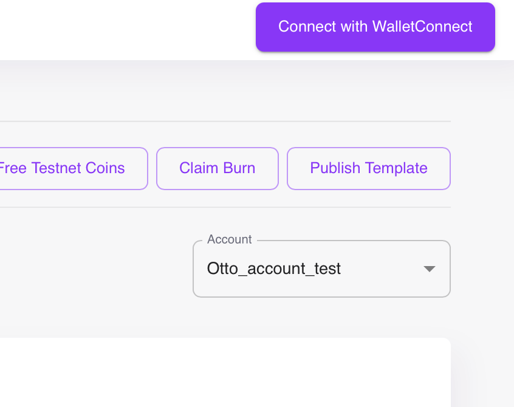

# Getting Started with Templates

Development on the Ootle, at its most basic, begins with the templates and smart contracts generated from them. These are the foundational blocks required to perform any Ootle specific functions.

But what are these? Think of a template as a specification for a smart contract. From a template, a user can create a smart contract for anything from a simple counter system to a fully-fleged NFT series. This contract then exists on its own, independent of the template, and can be used to perform specific actions. 

The community has focused on developing many templates for common activities envisioned for the Ootle with security and stability in mind. Rather than reinvent the wheel every time you would like to, for example, create an NFT series, you can leverage the templates that have been incorporated into the template library. However, for your own unique services or requirements, you may need to create your own.

To develop within the Ootle (both apps or Tari templates), you're going to need the following:

* The Tari CLI for quick scaffolding of template projects
* The `tari_template_lib` dependency
* Compile the template into WebAssembly (WASM) and commit it to the network.

This guide assumes some basic knowledge of Git, Cargo and Rust.

## Rust Template Documentation 
Documentation for the `tari_template_lib` can be found [here](https://docs.rs/tari_template_lib/latest/tari_template_lib/)

## Basic Concepts of the Ootle
- **Runtime Environment**: The runtime environment handles various elements such as buckets, proofs, substates, and components. It provides methods for manipulating these elements and managing their interactions. This includes the Tari Virtual Machine (TVM)
- **Workspace**: Manages variables and proofs, providing methods to insert and retrieve indexed values. It's a localised instance of the variables required when performing a transaction against a smart contract that exists within the TVM.
- **Component**: A reusable and addressable entity with associated state and methods. This exists as a substate on the Ootle, that can be called when required via a unique address.
- **Bucket**: Handles resources within the component or workspace. Buckets are used to securely move data between vaults.
- **Vault**: Securely stores resources and manages access control. An example of a vault is a collection of tokens, which needs to be updated as people withdraw or deposit more tokens into the vault.

## Writing Your First Template
We'll go through a simple template that will introduce you to the structure of a template and the core elements that are utilised. Below is the code for a template that will create a simple counter

```rust
use tari_template_lib::prelude::*;

#[template]

mod counter {
    pub struct Counter {
        value: u32,  // Contract state
    }

    impl Counter {
        // Method to create a new contract instance
        pub fn new() -> Self {
            Self { value: 0 }
        }

        // A read-only method
        pub fn value(&self) -> u32 {
            self.value
        }

        // A method that updates the contract state
        pub fn increase(&mut self) {
            self.value += 1;
        }
    }
}
```
The major elements of the template are captured in the first two lines.

```rust
use tari_template_lib::prelude::*;
```

This line imports all of the functions, types, macros and traits grouped within the ```prelude``` module of the Tari template library, ```tari_template_lib```. When you compile this code, you will have access to all the functions necessary to interact with the Tari blockchain through these standardised templates. But how?

This is partly explained by the second line:

```rust
#[template]
```

This a unique attribute macro within the Tari template library. This will allow rust to compile this basic code in such a way to generate the necessary code for interacting with the blockchain. So, for example, the following code:

```rust
    pub struct Counter {
        value: u32,  // Contract state
    }
```

Creates a custom data type that stores an integer value in Rust. But how does one "store" a value on the blockchain? The template macro we've selected interprets this instruction and then builds code around it for blockchain interaction. You're still creating a custom data type that can be modified, but the template macro understands what to add to the struct to store it on the blockchain.

Lastly, we have several methods for interacting with the structure contained within the implementation block:

```rust
    impl Counter {
        // Method to create a new contract instance
        pub fn new() -> Self {
            Self { value: 0 }
        }

        // A read-only method
        pub fn value(&self) -> u32 {
            self.value
        }

        // A method that updates the contract state
        pub fn increase(&mut self) {
            self.value += 1;
        }
    }
```

These are the means that we are going to intereact with the data type we've created in the Counter structure. We can create a new counter component on the network (so we can have multiple Counter components running at each of their component addresses), a method to call the current value of the counters, and a method to increase any counter's value by 1.

## Template Incorporating Vaults and Buckets
The `counter` template above is extremely simple - create a component on the Ootle, store a value in it and increment it. However, most of the interactions you will be with more complex `models` and `structs`. 

Consider the following example: you'd like to be able to mint your own meme coin, then distribute it freely to participants. You need to be able to burn these tokens if necessary, as well as track the total supply.

Fortunately, we already have a `fungible` template. You can generate it from the Tari CLI, but let's go through it here:

```rust
use tari_template_lib::prelude::*;

#[template]
pub mod fungtoken {
    use super::*;

    pub struct Fungtoken {
        vault: Vault,
    }

    impl Fungtoken {
        pub fn mint(initial_supply: Amount, token_symbol: String) -> Component<Self> {
            let coins = ResourceBuilder::fungible()
                .with_token_symbol(&token_symbol)
                .initial_supply(initial_supply);

            Component::new(Self { vault: Vault::from_bucket(coins) })
                .with_access_rules(AccessRules::allow_all())
                .create()
        }

        pub fn vault_address(&self) -> ResourceAddress {
            self.vault.resource_address()
        }

        pub fn take_free_coins(&mut self, amount: Amount) -> Bucket {
            self.vault.withdraw(amount)
        }

        pub fn balance(&self) -> Amount {
            self.vault.balance()
        }

        pub fn burn_coins(&mut self, amount: Amount) {
            let bucket = self.vault.withdraw(amount);
            bucket.burn();
        }

        pub fn total_supply(&self) -> Amount {
            ResourceManager::get(self.vault.resource_address()).total_supply()
        }
    }
}
```

Let's go through each function in the code to explain what it's doing:

```rust
    impl Fungtoken {
        pub fn mint(initial_supply: Amount, token_symbol: String) -> Component<Self> {
            let coins = ResourceBuilder::fungible()
                .with_token_symbol(&token_symbol)
                .initial_supply(initial_supply);

            Component::new(Self { vault: Vault::from_bucket(coins) })
                .with_access_rules(AccessRules::allow_all())
                .create()
        }
```

This function creates a new instance of the fungible token, called `Fungtoken`, and initializes it with an `initial_supply` of tokens, which is the amount of tokens minted. The `ResourceBuilder::fungible()` creates a fungible token resource. The `with_token_symbol()` method assigns a symbol to the token (like "USD" or "TARI"). The `initial_supply()` method specifies how many tokens should be minted initially.

The minted tokens are stored in a `Vault` using `Vault::from_bucket()`. The `with_access_rules(AccessRules::allow_all())` sets the permissions on the vault; you can specify specific accounts and holders of NFTs access, but this particular line allows anyone to interact with this component. A new component is created from the `Fungtoken` structure, and the tokens are stored in the `vault`.

```rust
pub fn vault_address(&self) -> ResourceAddress {
    self.vault.resource_address()
}
```
This function returns the resource address of the vault. The resource address is the global identifier for the resource (fungible token) stored in the vault.

```rust
pub fn take_free_coins(&mut self, amount: Amount) -> Bucket {
    self.vault.withdraw(amount)
}
```
This function allows the smart contract to withdraw tokens from the vault and return them in the form of a `Bucket`. `withdraw(amount)` removes a specific amount of tokens from the vault and returns them as a bucket. What is not shown here is necessarily what is done with the `bucket` following withdrawal.

```rust
pub fn balance(&self) -> Amount {
    self.vault.balance()
}
```
This function returns the current balance of the fungible token in the vault.

```rust
pub fn burn_coins(&mut self, amount: Amount) {
    let bucket = self.vault.withdraw(amount);
    bucket.burn();
}
```
This function allows the smart contract to "burn" tokens, i.e., permanently destroy a specified amount of tokens. First, the specified amount of tokens is withdrawn from the vault into a `Bucket`. Then, the `burn()` method is called on the `Bucket`, which destroys those tokens. Currently, the Ootle will panic if a bucket is attempted to be burned without the necessary permissions.

```rust
pub fn total_supply(&self) -> Amount {
    ResourceManager::get(self.vault.resource_address()).total_supply()
}
```
This function returns the total supply of the fungible token. `ResourceManager::get()` method retrieves information about the resource using its address, and `total_supply()` gives the total number of tokens in existence for that resource.

## Available Templates
The following templates have already been deployed to the network by default (You can view all currently deployed templates [here](http://18.217.22.26:12005/templates)):

* Account, XtraFaucet and AccountNFT are deployed by default on any new instance of the Ootle (for example, if you want to run your own local Swarm). This gives you, out of the box, templates from which to create accounts, send and receive transactions, create accounts, perform withdrawals and create proofs for confidential transactions. `XtraFaucet` exists mainly to distribute free coins to the wallet, while AccountNFT let's you mint NFTs.

In addition, several templates have been written over the course of the Ootle's development. Below is a non-exhaustive list of templates from different projects:

* The Tari CLI tool, discussed in the [Hackathon](hackathon.md) section, allows the user to create several pre-existing templates:
* The [Tari Tex](https://github.com/tari-labs/tex) includes templates for implementing a modern DEX on the Ootle.
* Likewise, the [Tariswap](https://github.com/tari-project/tariswap-ui/tree/main/src) provides a similar implementation, but with a demonstration of leveraging the tari.js library for interactions via TypeScript
* Two templates for creating stable coins can be found [here](https://github.com/tari-project/stable-coin/tree/main/templates/stable-coin)
* Lastly, wihtin the Ootle itself, there are several test templates that can be reviewed [here](https://github.com/tari-project/tari-dan/dan_layer/engine/tests/templates)

## How to deploy create template projects and deploy on the Ootle

There are currently several methods that are available to deploy your contracts on the Ootle. We'll start with the recommended method and then touch on an alternative:

### Recommended Method  
The `tari cli` tool, located [here](https://github.com/tari-project/tari-cli/), is used to generate template projects and create a couple of pre-existing templates for review. Instructions can be found on the main page of repo, but in short:

```bash
./tari create project_name
```

The above command will create a new skeleton project for template creation. Templates are then placed in the `templates` folder. To create a new template, 

```bash
../tari new [...yourtemplatename...]
✅ Init configuration and directories
✅ Refresh project templates repository
✅ Refresh wasm templates repository
✅ Collecting available WASM templates
🔎 Select WASM template |
  Fungible Tokens - A Fungible Token template to create your own fungible token.
  NFT - A simple NFT template to create your own.
  Tari Swap - Token swapping template
  Counter - A basic counter example template that can be incremented.
```

You will have an option to select from the available templates to create a template. Note that you will be able to replace this template with your own.

The `README.md` on the project's main page provides all the instructions. The main difference here is that you will **NOT** need to use the `tari-cli` to deploy the template, as publishing the template can be done via the Ootle Wallet's web interface.

To generate the WASM file from the project, you can run the following command:

```bash
cargo build --target wasm32-unknown-unknown --release
```

This will generate a .wasm file in the `target/wasm32-unknown-unknown/release` directory.

You can upload this file via the `Publish Template` button in your Wallet UI:

